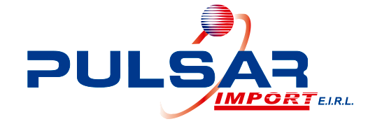

# 0.3. Integrante 3

# Baruc Octavio Toribio Huanca

**Código:** 20222127A

**Correo institucional:** baruc.toribio.h@uni.pe

**Correo:** baruc.toribio.142@gmail.com

# Sobre mí

Estudiante de ingeniería de sistemas con profundo interés en gestión de proyectos y el desarrollo profesional en entornos colaborativos. 

Más allá del ámbito profesional, me gusta mantenerme informado sobre la coyuntura actual del país, practicar deporte y, en general, 
mantener un estilo de vida saludable. 

# Preguntas frecuentes

**¿Por qué la UNI-FIIS?**

Escogí a la Universidad Nacional de Ingeniería porque es una universidad prestigiosa y se caracteriza por tener un nivel poco superior -en ingeniería- sobre las demás y, a la especialidad de ingeniería de sistemas porque es una disciplina que se adapta y evoluciona constantemente con el avance de la tecnología. A medida que nuevas herramientas salen a la luz, los profesionales en este campo deben estar en continua actualización para aprovechar al máximo las innovaciones.

**¿Cómo evalúo mi experiencia con los cursos de la carrera hasta el momento?**

Dentro del ecosistema de la especialidad ingeniería de sistemas predominan 4 grupos: Ciencias básicas, Humanidades, Programación y Organizaciones. Estas, en conjunto, me han proporcionado una visión más amplia, desde lo analítico y estructurado, hasta lo totalitario u holístico. 
En general, ha sido una experiencia enriquecedora, especialmente en áreas que combinan el conocimiento técnico con la gestión de proyectos y la mejora de procesos. A lo largo de los cursos, he aprendido que la ingeniería no solo trata sobre la creación de soluciones tecnológicas, sino también sobre cómo gestionarlas y optimizarlas para que sean más eficientes y efectivas. 

**¿Cuál es mi experiencia en programación y bases de datos?**

Los siguientes cursos de la carrera: Introducción a la computación, Algoritmia y estructura de datos y Programación orientada a objetos
me proporcionaron conocimientos a nivel intermedio en los siguientes lenguajes de programación: Python, C++ y Java, y en base de datos en SQL Server, mySQL y SQLite. 

**¿Cómo fue mi experiencia en Modelado Conceptual de Datos y qué tema elegí?**

Genial! Nos ayudó a comprender a profundidad la representación de las entidades y la relación entre ellas en una empresa. Junto con mis compañeros de grupo elegimos el Área de operaciones de **Pulsar Import EIRL**, empresa que se encarga de la comercialización y distribución de artefactos tecnológicos importados.

**¿Qué espero del curso?**

Tengo expectativas  altas sobre el curso, ya que no solamente contempla temas de programación sino tambien se busca desglosar partes de una empresa u organización para comprender su funcionamiento y tener un panorama que nos permita identificar puntos de mejora y proponer no solo soluciones físicas, sino tambien, de materia tecnológica. 

