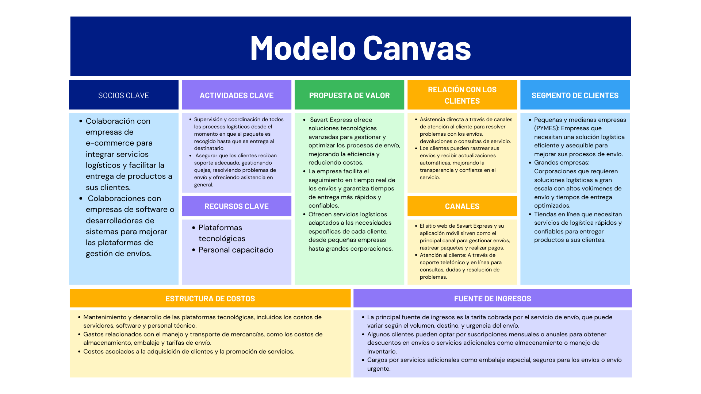

# 1.2. Modelo de Negocio

El modelo de negocio de Savart Express está basado en la prestación de soluciones logísticas integrales y tecnológicas para optimizar los procesos de envío. Su estrategia incluye la utilización de plataformas avanzadas para gestionar la cadena de suministro de manera eficiente, mejorando la experiencia del cliente.

