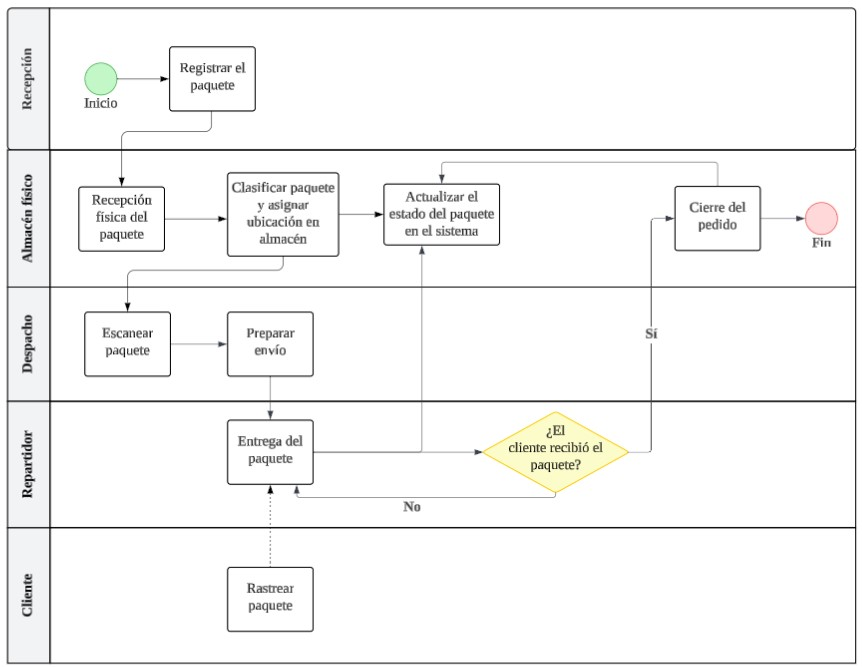
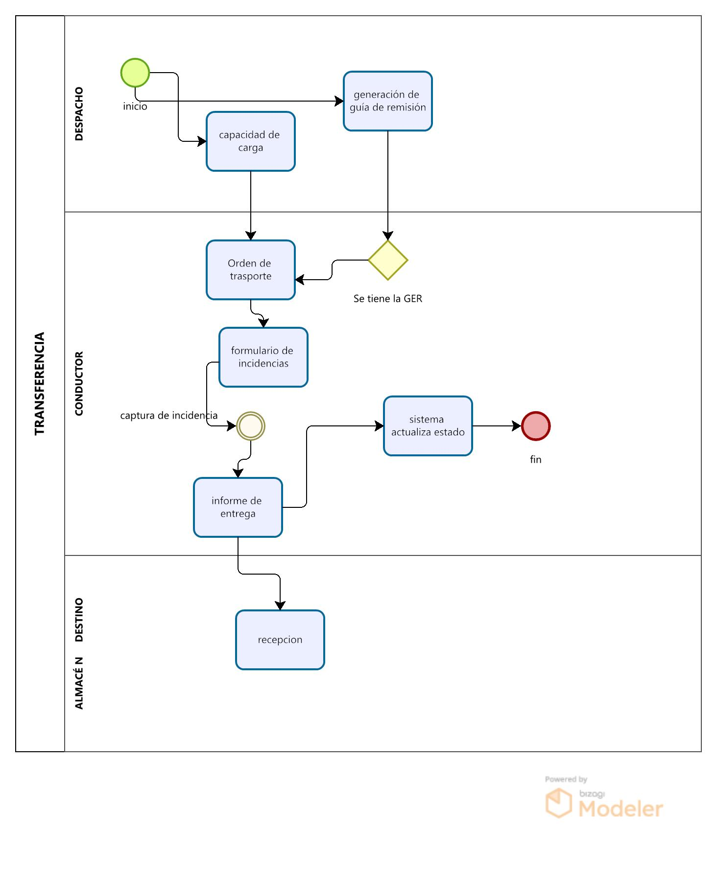

# 1.3. Procesos de Negocio identificados

# **Área: Almacén**

# Módulo 1 - Control de almacenes

| Número | Actividad                                                  | Descripción                                                                                       | Responsable         |
|--------|------------------------------------------------------------|---------------------------------------------------------------------------------------------------|---------------------|
| 1      | ----- | ----- | ---------  |
| 2      | ----- | ----- | ----------  |

# Módulo 2 - Manifiesto de carga

| Número | Actividad                                                  | Descripción                                                                                       | Responsable         |
|--------|------------------------------------------------------------|---------------------------------------------------------------------------------------------------|---------------------|
| 1      | ----- | ----- | ---------  |
| 2      | ----- | ----- | ----------  |

# Módulo 3 - Seguimiento del paquete (tracking)

**Diagrama de flujo funcional**

**Secuencia del proceso de negocio**

| N°  | Actividad                          | Descripción                                                                                                                                  | Responsable             |
|-----|------------------------------------|----------------------------------------------------------------------------------------------------------------------------------------------|--------------------------|
| 1   | Registrar el paquete               | Ingreso del paquete al sistema con sus datos.                                                                                                | Personal de Recepción    |
| 2   | Recepción física del paquete       | Confirmar el ingreso físico del paquete en el almacén para iniciar el proceso logístico.                                                     | Personal de almacén      |
| 3   | Clasificación y almacenamiento     | Clasificar el paquete según su tipo y asignar su ubicación en el almacén.                                                                    | Personal de almacén      |
| 4   | Escanear paquete                   | Escaneo del paquete para registrar y activar su preparación de despacho.                                                                     | Personal de Despacho     |
| 5   | Preparar envío                     | El paquete se alista para salir a reparto. Se registran los datos del cliente y su pedido, y se asigna un conductor para el envío.          | Personal de Despacho     |
| 6   | Entregar paquete                   | Entrega física del paquete al cliente final. Comprende el tránsito desde la salida del almacén hasta la entrega del paquete al cliente.     | Repartidor               |
| 7   | Rastrear paquete                   | El cliente revisa el estado del paquete en línea con su código de seguimiento.                                                              | Cliente                  |
| 8   | Actualizar el estado del paquete   | El sistema refleja el cambio de estado según su posición o entrega. Los estados pueden ser: en almacén, en tránsito y entregado.           | Personal de almacén      |
| 9   | Cierre del pedido                  | El pedido es marcado como completado y cerrado en el sistema.                                                                                | Personal de almacén      |

# Módulo 4 - Despacho

| Número | Actividad                                                  | Descripción                                                                                       | Responsable         |
|--------|------------------------------------------------------------|---------------------------------------------------------------------------------------------------|---------------------|
| 1      | ----- | ----- | ---------  |
| 2      | ----- | ----- | ----------  |

# Módulo 5 -Proceso de Transferencia 

 

| **Actividad**               | **Descripción**                                                                 | **Encargado**          |
|-----------------------------|---------------------------------------------------------------------------------|------------------------|
| **Registro de Salida**      | El sistema registra la salida del paquete del almacén origen con fecha, hora y destino. | Almacenero Origen      |
| **Asignación de Conductor** | Se asigna un conductor y vehículo para el traslado del paquete.                 | Supervisor de Logística|
| **Inicio de Traslado**      | El conductor recoge el paquete y confirma el inicio del viaje.                  | Transportista          |
| **Monitoreo en Tránsito**   | El sistema actualiza el estado del paquete a "En tránsito" y se rastrea su ubicación. | Operador de Seguimiento|
| **Recepción en Destino**    | El almacén destino verifica y registra la llegada del paquete, actualizando el inventario. | Almacenero Destino     |
| **Cierre de Transferencia** | El sistema marca el paquete como "Recibido" y finaliza el proceso.              | Sistema Automático     |
| **Gestión de Incidencias**  | Si hay daños, retrasos o pérdidas, se registran y escalan para su resolución.   | Supervisor de Transferencias |

# Módulo 6 - Recepción y transferencia

| Número | Actividad                                                  | Descripción                                                                                       | Responsable         |
|--------|------------------------------------------------------------|---------------------------------------------------------------------------------------------------|---------------------|
| 1      | ----- | ----- | ---------  |
| 2      | ----- | ----- | ----------  |

# Módulo 7 - Órdenes de trabajo

| Número | Actividad                                                  | Descripción                                                                                       | Responsable         |
|--------|------------------------------------------------------------|---------------------------------------------------------------------------------------------------|---------------------|
| 1      | ----- | ----- | ---------  |
| 2      | ----- | ----- | ----------  |
