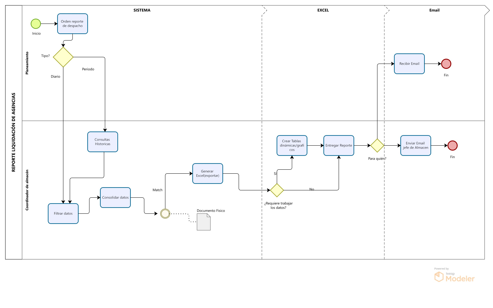

# 1.3. Procesos de Negocio identificados

# **Área: Almacén**

# Módulo 1 - Control de almacenes

| Número | Actividad                                                  | Descripción                                                                                       | Responsable         |
|--------|------------------------------------------------------------|---------------------------------------------------------------------------------------------------|---------------------|
| 1      | ----- | ----- | ---------  |
| 2      | ----- | ----- | ----------  |

# Módulo 2 - Manifiesto de carga

| Número | Actividad                                                  | Descripción                                                                                       | Responsable         |
|--------|------------------------------------------------------------|---------------------------------------------------------------------------------------------------|---------------------|
| 1      | ----- | ----- | ---------  |
| 2      | ----- | ----- | ----------  |

# Módulo 3 - Seguimiento del paquete (tracking)

**Diagrama de flujo funcional**

**Secuencia del proceso de negocio**

| N° | Actividad                              | Descripción                                                                 | Responsable           |
|----|------------------------------------------|-----------------------------------------------------------------------------|------------------------|
| 1  | Registrar el paquete                     | Ingreso del paquete al sistema con sus datos.                       | Personal de Recepción      |
| 2  | Recepción física del paquete             | Confirmar el ingreso físico del paquete en el almacén para iniciar el proceso logístico.     | Personal de almacén         |
| 3  | Clasificación y almacenamiento          | Clasificar el paquete según su tipo y asignar su ubicación en el almacén.          | Personal de almacén         |
| 4  | Escanear paquete                         | Escaneo del paquete para registrar y activar su preparación de despacho.   | Personal de Despacho       |
| 5  | Preparar envío                           | El paquete se alista para salir a reparto. Se registran los datos del cliente y su pedido, y se asigna un conductor para el envío.                                 | Personal de Despacho       |
| 6  | Entregar paquete                         | Entrega física del paquete al cliente final. Comprende el tránsito desde la salida del almacén hasta la entrega del paquete al cliente. En este proceso el cliente puede rastrear el paquete.                          | Repartidor             |
| 7  | Rastrear paquete                         | El cliente revisa el estado del paquete en línea con su código de seguimiento. | Cliente             |
| 8  | Actualizar el estado del paquete         | El sistema refleja el cambio de estado según su posición o entrega. Los estados pueden ser: en almacén, en tránsito y entregado      | Personal de almacén      |
| 9 | Cierre del pedido                        | El pedido es marcado como completado y cerrado en el sistema.              | Personal de almacén   |

# Módulo 4 - Despacho

| Número | Actividad                                                  | Descripción                                                                                       | Responsable         |
|--------|------------------------------------------------------------|---------------------------------------------------------------------------------------------------|---------------------|
| 1      | ----- | ----- | ---------  |
| 2      | ----- | ----- | ----------  |

# Módulo 5 - Reportes liquidación de agencias

| Número | Actividad                                                  | Descripción                                                                                       | Responsable         |
|--------|------------------------------------------------------------|---------------------------------------------------------------------------------------------------|---------------------|
| 1      | Orden reporte de despacho |**Automático**: Diario al cierre del día. **Manual**: Solicitud explícita por período (ej.: semanal/mensual). | Área planeamiento/jefe de alamacén  |
| 2      |  Filtrar datos| **Diario**: Todo lo procesado en el día. **Período**: Filtra por rango de fechas, agencia, conductor, etc.| Coordinador de Almacén  |
| 3      | Consolidar datos | nir información de: - Manifiestos, órdenes de trabajo y recepción. - **Hacer match y confirmar con documento físico** (guías, listas de paquetes).| Coordinador de Almacén    |
| 4     | Generar Excel | Exportar con: - Datos filtrados. - Pestañas separadas (diario/período). | Coordinador de Almacén  |
| 5     | Crear tablas dinámicas |Opcional**: Configurar tablas/gráficos para análisis rápido.| Coordinador de Almacén     |
| 6      | Entregar reporte | Diario: Envío automático al sistema compartido.Período: Email directo a Planeamiento. | Coordinador de Almacén  |
| 7      | Consultas históricas| Acceso a reportes pasados (solo lectura) con los mismos filtros.| Sistemas /coordinador de Almacén  |
| 8     | Enviar email a Jefe de Almacén | Notificar con copia del reporte generado y documentación adjunta (PDF/Excel).| Coordinador de Almacén  |
| 9     | Enviar email a Planeamiento | Entregar reporte final con datos filtrados y formato solicitado. | Coordinador de Almacén  |

# Módulo 6 - Recepción y transferencia

| Número | Actividad                                                  | Descripción                                                                                       | Responsable         |
|--------|------------------------------------------------------------|---------------------------------------------------------------------------------------------------|---------------------|
| 1      | ----- | ----- | ---------  |
| 2      | ----- | ----- | ----------  |

# Módulo 7 - Órdenes de trabajo

| Número | Actividad                                                  | Descripción                                                                                       | Responsable         |
|--------|------------------------------------------------------------|---------------------------------------------------------------------------------------------------|---------------------|
| 1      | ----- | ----- | ---------  |
| 2      | ----- | ----- | ----------  |
