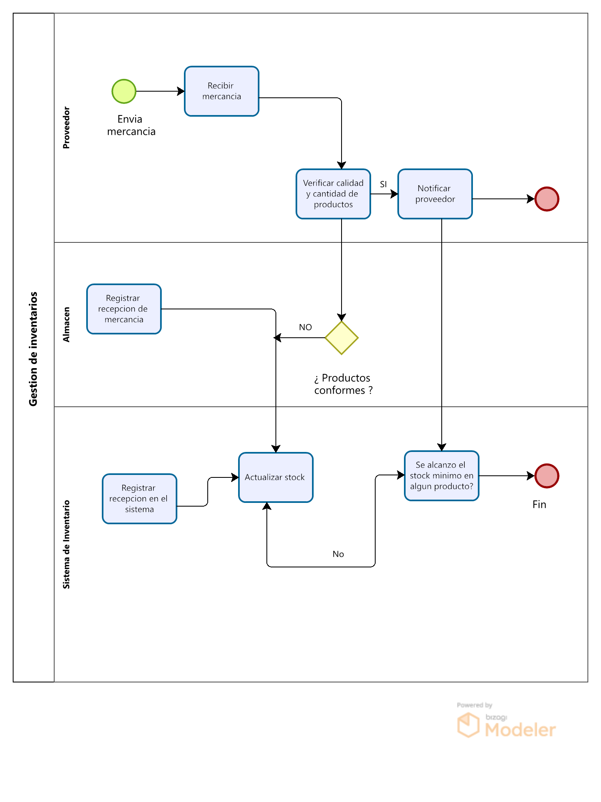
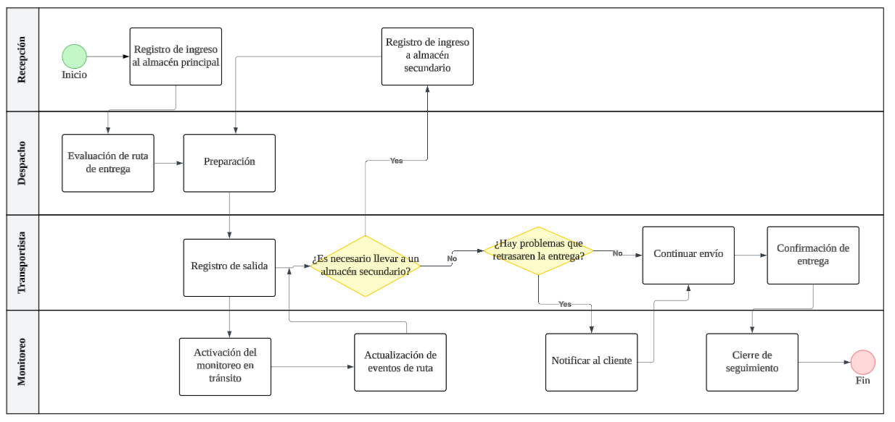
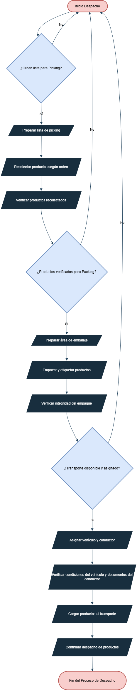

# 1.3. Procesos de Negocio identificados

# **Área: Almacén**

# Módulo 1 - Gestion de Inventarios 

**Diagrama de flujo funcional**

| Nº | Actividad                              | Descripción                                                                 | Responsable              |
|----|----------------------------------------|-----------------------------------------------------------------------------|--------------------------|
| 1  | Recepción de productos en almacen.     | Se recibe información del Módulo de Recepción para registrar el ingreso físico de productos.   | Auxiliar de almacén      |
| 2  | Registro de entrada en sistema.        | Se registran los datos del producto: código, lote, vencimiento, estado y cantidad.| Operador de inventario    |
| 3  | Asignación de ubicación física.        | Se determina y registra la ubicación del producto dentro del almacén según criterios logísticos.        | Jefe de almacén      |
| 4  | Actualización de stock disponible.| El sistema refleja en tiempo real el stock ingresado y su ubicación.             | Sistema automatizado.      |
| 5  | Generación de alertas de inventario.   | El sistema evalúa umbrales definidos y emite alertas por quiebre o sobrestock.       | Sistema automatizado    |
| 6  | Reubicación o transferencia interna.   | Se trasladan productos entre zonas del almacén por motivos operativos o logísticos.         | Personal de almacén       |
| 7  | Preparación de pedidos.  | Se generan listas de picking según solicitudes de despacho o consolidación.     | Auxiliar de picking     |
| 8  | Consolidación y embalaje de productos.   | Los productos se agrupan por destino o cliente, y se embalan para su despacho. | Operador de consolidación   |
| 9  | Registro de salida en sistema.           | Se confirma la salida física de los productos del almacén, vinculada al manifiesto de carga.     | Operador de inventario        |
| 10 | Ejecución de inventario cíclico.   | Se realizan conteos físicos parciales para validar la precisión del stock registrado.     | Auditor de almacén      |
| 11 | Generación de reportes y auditorías.  | Se emiten reportes de movimientos, ajustes y trazabilidad para control y mejora continua.  | Analista de inventarios        |

# Módulo 2 - Recepción 

| Nº  | Actividad                     | Descripción                                                                 | Responsable            |
|-----|-------------------------------|-----------------------------------------------------------------------------|------------------------|
| 1   | Envío de mercadería            | El proveedor despacha la mercadería hacia el centro de recepción.            | Proveedor              |
| 2   | Recepción de mercadería        | El empleado de recepción recibe físicamente los productos enviados.         | Empleado de recepción  |
| 3   | Envío de notificación de recepción | El empleado comunica la recepción al sistema para iniciar el proceso de verificación. | Empleado de recepción  |
| 4   | Recepción de notificación      | El módulo de Tracking recibe el aviso de recepción para iniciar la actualización del pedido. | Sistema (Tracking)     |
| 5   | Evaluación de completitud      | Se verifica si el contenido recibido coincide con lo solicitado en el pedido. | Empleado de recepción  |
| 6   | Evaluación de daños            | Se inspecciona el estado físico de los productos para detectar posibles daños. | Empleado de recepción  |
| 7   | Registro de incidencia         | En caso de faltantes o daños, se registra la incidencia correspondiente.     | Empleado de recepción  |
| 8   | Actualización de estado del pedido | El módulo de Tracking actualiza el estado del pedido según el resultado de la recepción. | Sistema (Tracking)     |
| 9   | Recepción completa             | Si no se detectan incidencias, se cierra el proceso marcando la recepción como completa. | Sistema                |
| 10  | Recepción de actualización de estado | El proveedor recibe notificación sobre el estado actualizado de la recepción. | Proveedor              |

# Módulo 3 - Seguimiento del paquete (tracking)

**Diagrama de flujo funcional**

**Secuencia del proceso de negocio**

| Nº | Actividad                                     | Descripción                                                                                                                                   | Responsable                   |
|----|-----------------------------------------------|-----------------------------------------------------------------------------------------------------------------------------------------------|-------------------------------|
| 1  | Registro de ingreso al almacén principal       | El paquete es escaneado al llegar a las instalaciones de Savar Express. Inicia el seguimiento.                                                | Personal de recepción         |
| 2  | Evaluación de ruta de entrega                  | Se verifica si la dirección del cliente está en zona directa o requiere traslado a un almacén secundario.                                    | Personal de despacho     |
| 3  | Actualización en sistema y visibilidad cliente | El cliente puede visualizar en la app o web que su paquete fue recibido y está siendo procesado.                                              | Sistema de monitoreo        |
| 4  | Preparación de despacho                        | Se asigna unidad de transporte y se emite la guía. Se programa salida hacia cliente o almacén secundario.                                    | Personal de despacho          |
| 5  | Registro de salida de almacén principal        | Se escanea el paquete y se marca su salida física.                                                                                            | Personal de despacho          |
| 6  | Activación del monitoreo en tránsito           | Se activa GPS del vehículo. El paquete puede ser monitoreado en tiempo real.                                                                  | Sistema de monitoreo|
| 7  | Registro de eventos durante el tránsito        | Se registran eventos relevantes: llegada a almacén secundario, paso por agencia o zonas intermedias.                                          | Sistema de monitoreo       |
| 8  | Generación de alertas por retraso              | Si hay desvíos, retrasos o demoras fuera del tiempo estimado, el sistema genera alertas automáticas.                                          | Sistema de monitoreo          |
| 9  | Llegada a almacén secundario      | Si el destino requiere, el paquete llega a un almacén provincial. Se escanea e ingresa al sistema.                                            | Personal almacén   |
| 10 | Preparación para entrega final                 | Se carga el paquete a una unidad de reparto para entrega al cliente.                                                                          | Personal de despacho          |
| 11 | Registro de salida para entrega                | Se registra la salida del paquete desde el punto provincial o zona de última milla.                                                           | Repartidor                    |
| 12 | Monitoreo de entrega en tiempo real            | El cliente y el sistema visualizan en tiempo real la ubicación del repartidor.                                                               | Sistema de monitoreo     |
| 13 | Notificación automática al cliente             | El cliente recibe alertas por correo, SMS o app sobre cada nuevo evento del paquete.                                                          | Sistema de monitoreo    |
| 14 | Confirmación de entrega                        | El paquete es escaneado y marcado como entregado con firma o código del cliente.                                                              | Repartidor                    |
| 15 | Cierre del proceso de seguimiento              | Se archiva el historial completo: tiempos, eventos, entregas, alertas, incidentes.                                                            |Sistema de monitoreo     |

# Módulo 4 - Despacho

| Nº  | Actividad                              | Descripción                                                                                      | Responsable              |
|-----|----------------------------------------|--------------------------------------------------------------------------------------------------|--------------------------|
| 1   | Recepción del manifiesto               | Recepción del manifiesto de carga previamente generado y validado por el área correspondiente.   | Coordinador de despacho  |
| 2   | Verificación de paquetes a despachar   | Revisión física y documental de los paquetes listados en el manifiesto para confirmar coincidencia. | Auxiliar de despacho     |
| 3   | Preparación del punto de carga         | Habilitación del área de carga y señalización del vehículo correspondiente.                      | Auxiliar de almacén      |
| 4   | Inspección de unidad de transporte     | Verificación del estado de la unidad asignada (limpieza, capacidad, condiciones de seguridad).   | Supervisor de despacho   |
| 5   | Verificación del conductor             | Validación de identidad y documentación del conductor asignado (licencia, hoja de ruta, etc.).   | Coordinador de despacho  |
| 6   | Carga de paquetes en la unidad         | Ejecución de la carga física de los paquetes en el vehículo según el orden logístico establecido.| Auxiliares de carga       |
| 7   | Sellado y aseguramiento de carga       | Aplicación de medidas de seguridad como cintas, sellos y amarre según el tipo de carga.          | Auxiliar de despacho     |
| 8   | Confirmación de carga completada       | Revisión final para confirmar que todos los paquetes del manifiesto han sido correctamente cargados. | Supervisor de despacho |
| 9   | Firma de conformidad de salida         | Firma por parte del conductor y responsable de despacho que valida la salida de la carga.        | Conductor / Supervisor   |
| 10  | Registro de salida en sistema          | Ingreso de la hora de salida, datos del transporte y carga al sistema de gestión logística.      | Operador logístico       |
| 11  | Activación de seguimiento              | Comunicación al módulo de seguimiento (tracking) para el inicio del monitoreo del trayecto.      | Sistema automatizado     |
| 12  | Archivo de documentos de salida        | Digitalización y archivo físico/digital de los documentos asociados al despacho.                 | Analista documentario    |

# Módulo 5 -Proceso de Transferencia 

 

| **Actividad**               | **Descripción**                                                                 | **Encargado**          |
|-----------------------------|---------------------------------------------------------------------------------|------------------------|
| **Registro de Salida**      | El sistema registra la salida del paquete del almacén origen con fecha, hora y destino. | Almacenero Origen      |
| **Asignación de Conductor** | Se asigna un conductor y vehículo para el traslado del paquete.                 | Supervisor de Logística|
| **Inicio de Traslado**      | El conductor recoge el paquete y confirma el inicio del viaje.                  | Transportista          |
| **Monitoreo en Tránsito**   | El sistema actualiza el estado del paquete a "En tránsito" y se rastrea su ubicación. | Operador de Seguimiento|
| **Recepción en Destino**    | El almacén destino verifica y registra la llegada del paquete, actualizando el inventario. | Almacenero Destino     |
| **Cierre de Transferencia** | El sistema marca el paquete como "Recibido" y finaliza el proceso.              | Sistema Automático     |
| **Gestión de Incidencias**  | Si hay daños, retrasos o pérdidas, se registran y escalan para su resolución.   | Supervisor de Transferencias |

# Módulo 6 -Control de equipos