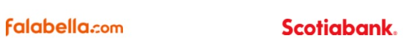
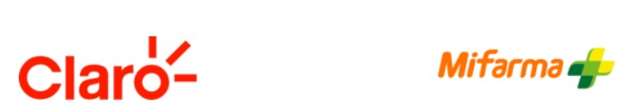
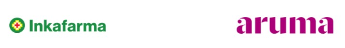
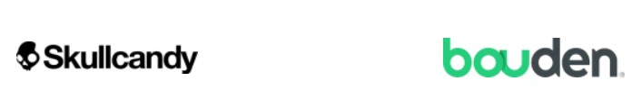
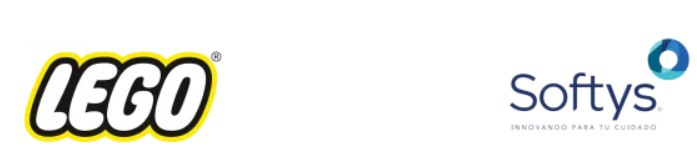

# 1. Descripción de la Empresa Elegida

# **SAVAR express**

# Descripción general

Formamos parte del grupo SAVAR Corporación Logística, empresa peruana líder con 43 años en el mercado, con una amplia red de distribución y comercio exterior. Con capacidad para dar soporte a la operación de cientos de empresas del Perú y el mundo.

Desde el 2019, nacemos para ser la unidad especializada en logística para comercio electrónico. Nos diferenciamos por el desarrollo de tecnologías que junto a una amplia infraestructura permiten la automatización de procesos logrando tiempos de entrega más cortos y una mejor experiencia del cliente.

# Misión

Construir un ecosistema logístico innovador y eficiente que transforme la experiencia de envío en Perú, proporcionando soluciones de alta calidad que beneficien a todos los actores de la industria, con un compromiso firme hacia la profesionalización y la excelencia del servicio.

# Visión

Ser la empresa líder en soluciones logísticas en Perú, demostrando que la logística puede ser un sector profesional y de excelencia, con un impacto positivo en la cadena de valor y la satisfacción de nuestros clientes.

# Servicios y productos

Brindar un servicio logístico basado en tecnología, mejorando los procesos de envío para que puedas mejorar la experiencia de tus clientes.

Almacén mejorado para la preparación de pedidos en menor tiempo. Accede a una plataforma integrada con toda tu operación.

Mejorar los tiempos de entrega, capacidad y cobertura nacional. Atiende altos picos de demanda.

Mejorar la experiencia de los usuarios con más funciones desde nuestra app. Disponible en la web y dispositivos móviles.

# Marcas líderes que confían en SAVAR

