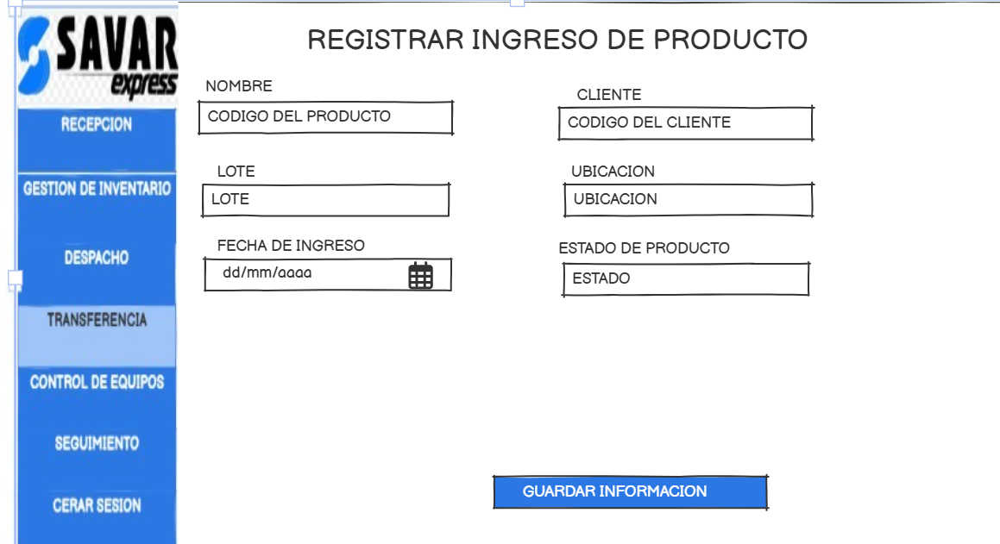
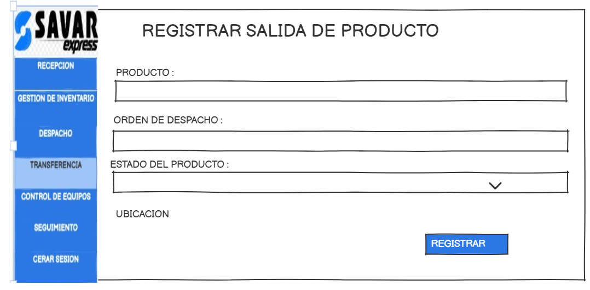
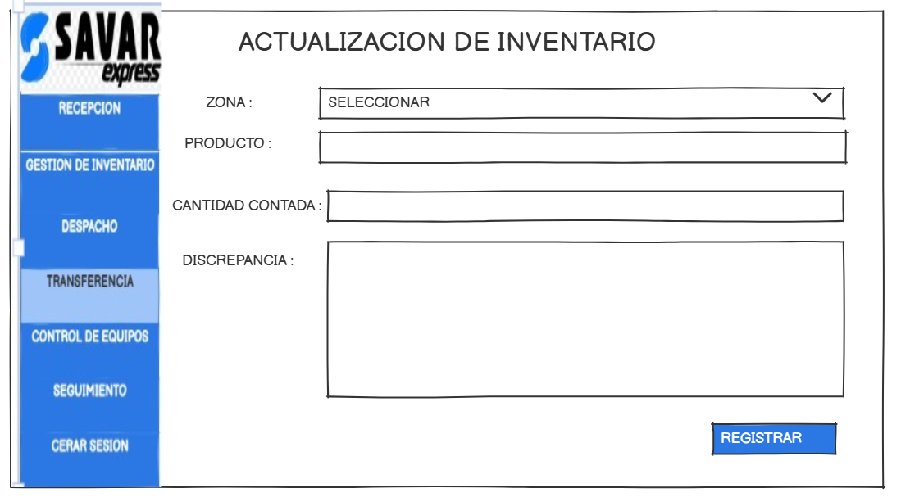
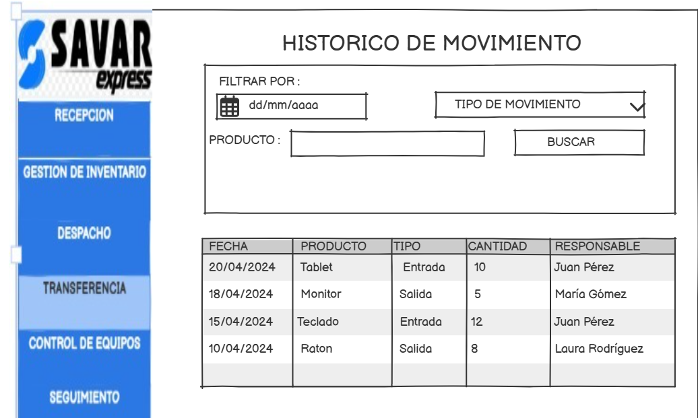

# 3.2 Módulo 2 - Gestion de Inventarios 

# Elaborado por : Ernesto Salazar Ramos 
 
# Módulo de Gestión de Inventario

## Requerimientos Funcionales

RF01 - Registro de ingreso de productos. 

RF02 - Registro de salida de productos. 

RF03 -Gestión de ubicaciones.   

RF04 - Conteo cíclico. 

RF05 -  Reubicación de productos.

RF06 - Trazabilidad de movimientos.

RF07 - Notificación de traslados entre almacenes 

RF08 - Visualización de inventario en tiempo real.

RF09 -  Generación de alertas de stock   
---

##  Casos de Uso

### Caso de Uso 1: Registrar Ingreso de Producto

| **Campo**              |**Descripción**                                                                |
|-------------------|-----------------------------------------------------------------------------|
| **Objetivo**       | Ingresar productos al sistema y al almacén.                                |
| **Descripción**    | Captura la información de nuevos productos que ingresan al almacén.        |
| **Actor Primario** | Operador de almacén                                                       |
| **Actor Secundario** | Sistema de gestión de almacenes                                          |
| **Precondiciones** | Documento de recepción validado.                                           |
| **Flujo de Eventos** | 1. Ingresar al sistema.   2. Seleccionar "Registrar ingreso".   3. Escanear producto o ingresar manualmente.   4. Registrar lote, estado y fecha de vencimiento.   5. Confirmar ubicación. |
| **Postcondición** | Producto registrado y reflejado en el inventario.                         |

---

### Prototipo

### Caso de Uso 2: Registrar Salida de Producto

|**Campo**             |**Descripción**                                                                 |
|-------------------|-----------------------------------------------------------------------------|
| **Objetivo**       | Registrar productos despachados.                                            |
| **Descripción**    | Permite registrar productos que salen del almacén.                         |
| **Actor Primario** | Operador de almacén                                                       |
| **Actor Secundario** | Sistema de gestión de almacenes                                          |
| **Precondiciones** | Existe una orden de despacho validada.                                     |
| **Flujo de Eventos** | 1. Ingresar al sistema.   2. Escanear o ingresar producto.   3. Validar orden.   4. Confirmar estado y ubicación.   5. Registrar salida. |
| **Postcondición** | Inventario actualizado, producto marcado como despachado.                  |

---

### Prototipo

### Caso de Uso 3: Realizar Conteo Cíclico

| **Campo**            | **Descripción**                                                                   |
|-------------------|-----------------------------------------------------------------------------|
| **Objetivo**       | Verificar físicamente el stock.                                            |
| **Descripción**    | Permite realizar conteos periódicos para verificar la precisión del inventario. |
| **Actor Primario** | Auditor de inventario                                                     |
| **Actor Secundario** | Sistema de gestión de almacenes                                          |
| **Precondiciones** | Existe programación de conteo cíclico.                                     |
| **Flujo de Eventos** | 1. Seleccionar zona o productos.   2. Realizar conteo.   3. Comparar con sistema.   4. Registrar discrepancias. |
| **Postcondición** | Inventario actualizado según resultados del conteo.                        |

---

### Prototipo

### Caso de Uso 4: Reubicar Producto

| **Campo**           | **Descripción**                                                               |
|-------------------|-----------------------------------------------------------------------------|
| **Objetivo**       | Cambiar la ubicación de productos dentro del almacén.                      |
| **Descripción**    | Permite mover productos entre zonas del almacén.                           |
| **Actor Primario** | Operador de almacén                                                       |
| **Actor Secundario** | Sistema de gestión de almacenes                                          |
| **Precondiciones** | El producto ya debe estar registrado en el sistema.                        |
| **Flujo de Eventos** | 1. Seleccionar producto.   2. Elegir nueva ubicación (manual o sugerida).   3. Confirmar movimiento. |
| **Postcondición** | Producto ubicado en nueva zona dentro del almacén.                         |

---

### Prototipo

