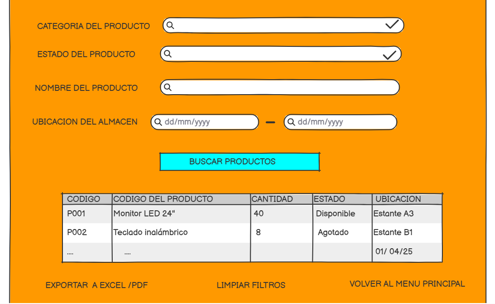
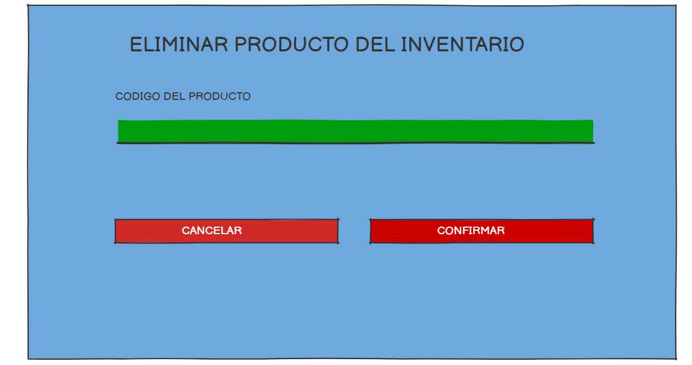
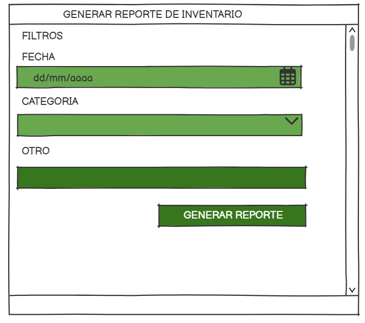
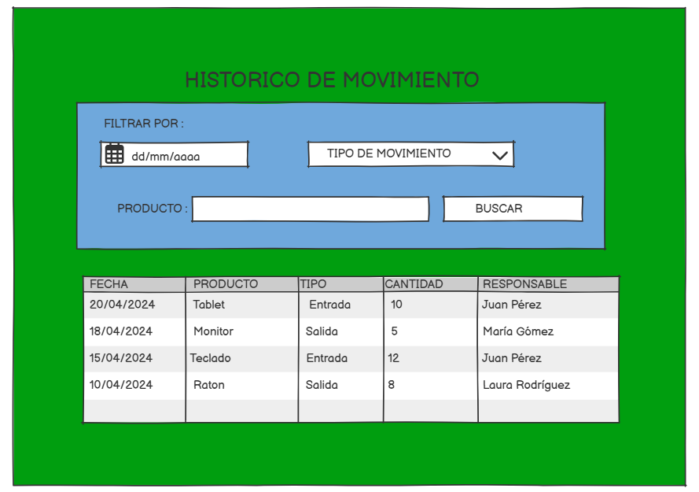
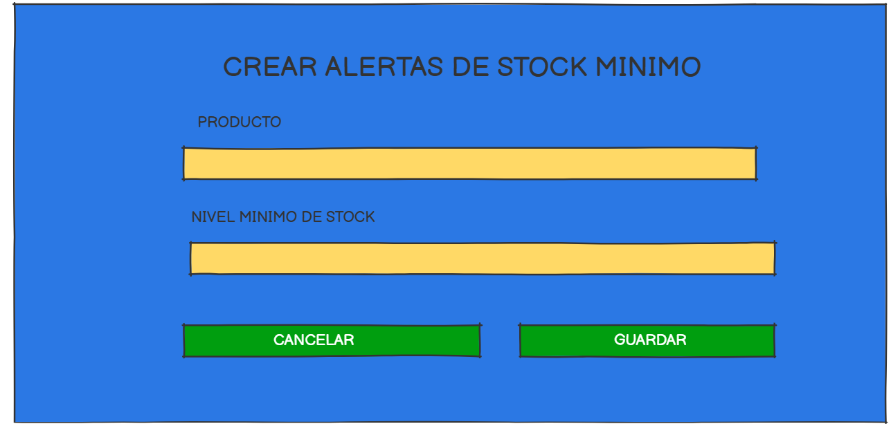

# 3.2 Módulo 2 - Control de Almacenes 

# Elaborado por : Ernesto Salazar Ramos 
 
## **Requerimientos funcionales**

RF01 - Registrar el ingreso de productos al almacén con datos de proveedor, fecha y guía.
RF02 - Verificar y validar la cantidad, estado y tipo de producto al ingresar.
RF03 - Almacenar productos según ubicación asignada, tipo y condiciones requeridas.
RF04 - Permitir consultas de stock actual por producto, ubicación o proveedor.
RF05 - Generar alertas automáticas cuando el stock alcance niveles mínimos.
RF06 - Registrar traslados internos entre zonas o almacenes con trazabilidad.
RF07 - Registrar salidas de productos por despacho, devolución o deterioro.
RF08 - Emitir reportes de entradas, salidas e inventario por período definido.
RF09 - Registrar y consultar incidencias relacionadas con pérdidas o daños.
RF10 - Permitir la anulación o corrección de movimientos por error operativo.

### Caso de Uso 1: Informe de productos al almacen 

| **Campo**            | **Descripción**                                                                 |
|----------------------|---------------------------------------------------------------------------------|
| **Objetivo**         |Permitir que el responsable de almacén informe el ingreso de productos para el aconyrol del mismo. |
| **Descripción**      | Se genera el informe detallado de los productos del almacen 
| **Actor Primario**   | Responsable de almacén                                                           |
| **Actor Secundario** | Sistema de gestión de paquetes                                                   |
| **Precondiciones**   | El paquete debe haber llegado al almacén.                                        |
| **Flujo de Eventos** | 1. El responsable de almacén accede al sistema.  
2. Selecciona "Registrar Paquete Recibido".  
3. Ingresa el número de seguimiento del paquete.  
4. El sistema verifica y muestra la información asociada.  
5. El responsable confirma los detalles.  
6. El sistema guarda los datos. |
| **Postcondición**    | El paquete queda registrado en el sistema de seguimiento.                       |

---

### Prototipo

### Caso de Uso 2: Consultar stock de productos

| **Campo**            | **Descripción**                                                                 |
|----------------------|---------------------------------------------------------------------------------|
| **Objetivo**         | Permitir al responsable consultar el stock actual de productos en el almacén.   |
| **Descripción**      | Proceso para visualizar existencias, ubicaciones y estado de los productos.     |
| **Actor Primario**   | Responsable de almacén                                                         |
| **Actor Secundario** | Sistema de gestión de almacenes                                                |
| **Precondiciones**   | Deben existir productos registrados en el sistema.                             |
| **Flujo de Eventos** | 1. El responsable accede al sistema. 2. Selecciona "Consultar stock". 3. Ingresa filtros o criterios de búsqueda. 4. El sistema muestra los resultados. |
| **Postcondición**    | El sistema muestra el stock disponible y sus ubicaciones.                     |

---
---

### Prototipo

### Caso de Uso 3: Eliminar producto del inventario 

| **Campo**            | **Descripción**                                                                 |
|----------------------|---------------------------------------------------------------------------------|
| **Objetivo**         | Permitir eliminar un producto del inventario cuando ya no esté disponible o vigente. |
| **Descripción**      | Proceso para eliminar productos por obsolescencia, deterioro o salida definitiva. |
| **Actor Primario**   | Responsable de almacén                                                         |
| **Actor Secundario** | Sistema de gestión de almacenes                                                |
| **Precondiciones**   | El producto debe estar registrado.                                              |
| **Flujo de Eventos** | 1. Accede al sistema. 2. Selecciona "Eliminar producto". 3. Ingresa el código. 4. Confirma la eliminación. 5. El sistema elimina el producto. |
| **Postcondición**    | El producto desaparece del inventario.                                        |

---

### Prototipo

 

## Caso de Uso 4: Generar reporte de inventario

| 
| **Campo**            | **Descripción**                                                                 |
|----------------------|---------------------------------------------------------------------------------|
| **Objetivo**         | Generar reportes detallados sobre el estado actual del inventario.              |
| **Descripción**      | Permite exportar reportes de productos almacenados con filtros por fecha, categoría, etc. |
| **Actor Primario**   | Responsable de almacén                                                         |
| **Actor Secundario** | Sistema de gestión de almacenes                                                |
| **Precondiciones**   | Debe haber productos registrados.                                               |
| **Flujo de Eventos** | 1. Accede al sistema. 2. Selecciona "Generar reporte". 3. Aplica filtros. 4. El sistema genera un PDF o Excel. |
| **Excepciones**      | Si no hay productos registrados, muestra mensaje de advertencia.               |
| **Postcondición**    | Se genera el reporte y queda disponible para descarga.                        |

---

### Prototipo

### Caso de Uso 5:  Historico de movimiento 

| **Campo**            | **Descripción**                                                                 |
|----------------------|---------------------------------------------------------------------------------|
| **Objetivo**         | Consultar y revisar el historial de movimientos (entradas y salidas) de productos del almacén. |
| **Descripción**      |Permite visualizar todos los movimientos registrados de cada producto, incluyendo fechas, cantidades, tipo de movimiento y responsable.   |
| **Actor Primario**   | Responsable de almacén                                                         |
| **Actor Secundario** | Sistema de gestión de almacenes                                                |
| **Precondiciones**   | Deben existir registros previos de entradas o salidas en el sistema.                            |
| **Flujo de Eventos** | 1. Accede al sistema.
2. Selecciona "Histórico de movimiento".
3. Filtra por fecha, producto o tipo de movimiento.
4. Revisa los resultados mostrados.
| **Postcondición**    |Se visualiza el historial completo de movimientos según los filtros aplicados.

---

### Prototipo

### Caso de Uso 6: Crear alertas de stock mínimo

| **Campo**            | **Descripción**                                                                 |
|----------------------|---------------------------------------------------------------------------------|
| **Objetivo**         | Configurar alertas cuando el stock de un producto baje de un nivel mínimo.      |
| **Descripción**      | Ayuda a prevenir quiebres de stock mediante alertas automáticas.                |
| **Actor Primario**   | Responsable de almacén                                                         |
| **Actor Secundario** | Sistema de gestión de almacenes                                                |
| **Precondiciones**   | El producto debe estar registrado y tener un límite mínimo configurado.         |
| **Flujo de Eventos** | 1. Accede al sistema. 2. Selecciona producto. 3. Configura nivel mínimo. 4. El sistema activa la alerta cuando se cumple la condición. |
| **Excepciones**      | Si no hay cantidad mínima configurada, no se genera alerta.                    |
| **Postcondición**    | El sistema notifica cuando el producto baja del nivel mínimo.                 |

---

### Prototipo

### Caso de Uso 7: Notificar traslado de productos entre almacenes

| **Campo**            | **Descripción**                                                                 |
|----------------------|---------------------------------------------------------------------------------|
| **Objetivo**         | Notificar el traslado de productos de un almacén a otro.                        |
| **Descripción**      | Registra el cambio de ubicación de los productos entre diferentes almacenes.    |
| **Actor Primario**   | Responsable de almacén                                                         |
| **Actor Secundario** | Sistema de gestión de almacenes                                                |
| **Precondiciones**   | El producto debe estar registrado y disponible para traslado.                   |
| **Flujo de Eventos** | 1. Accede al sistema. 2. Selecciona "Traslado de productos". 3. Indica almacén origen y destino. 4. El sistema registra el movimiento. |
| **Postcondición**    | El producto se actualiza en el inventario del nuevo almacén.                  |

---
---

### Prototipo

