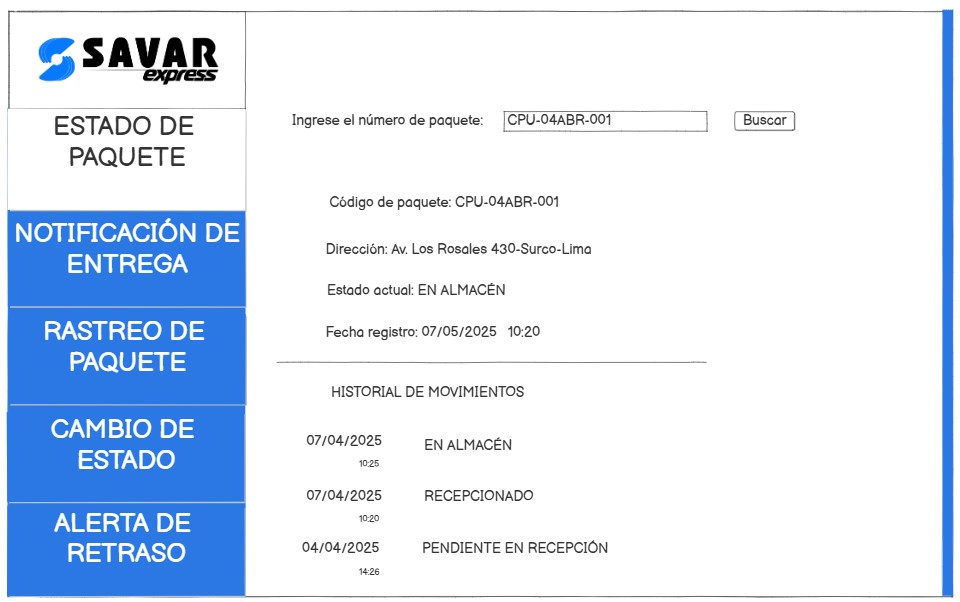
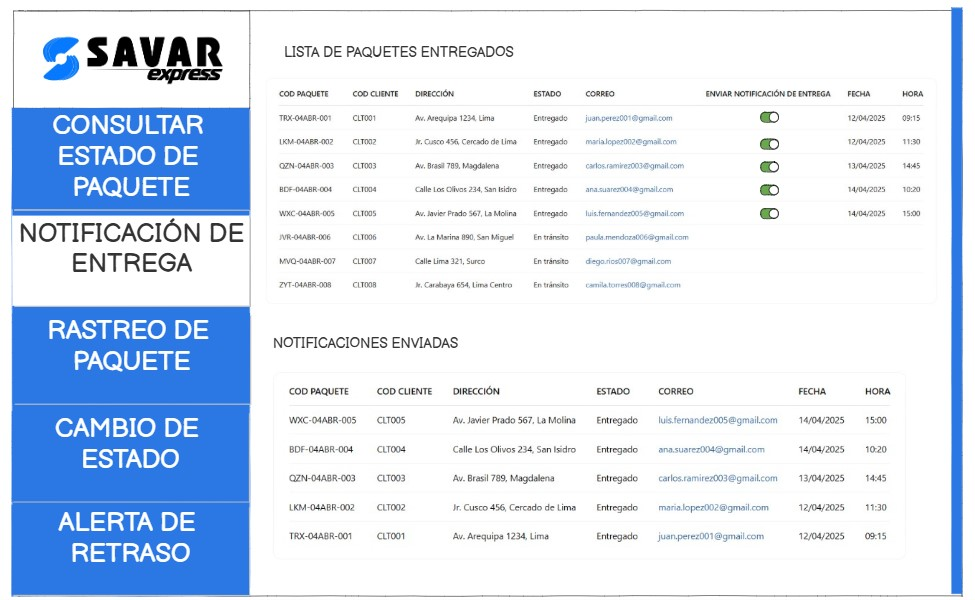
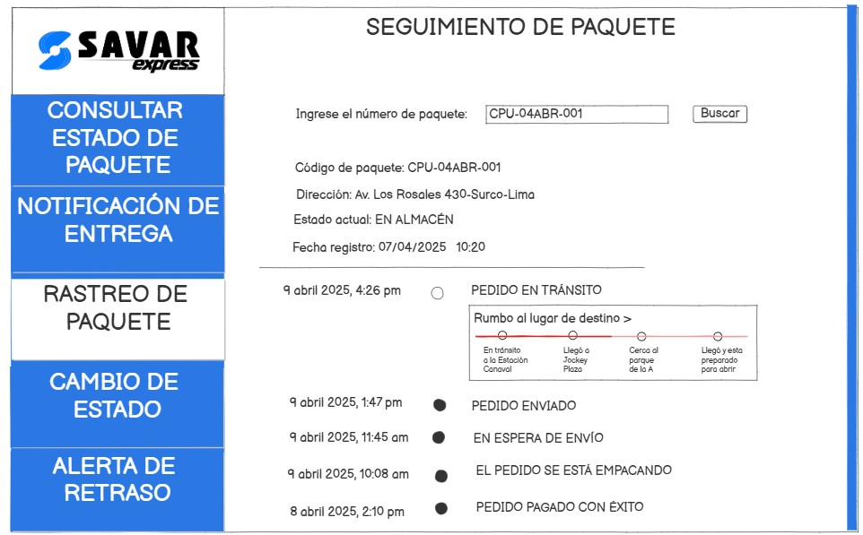
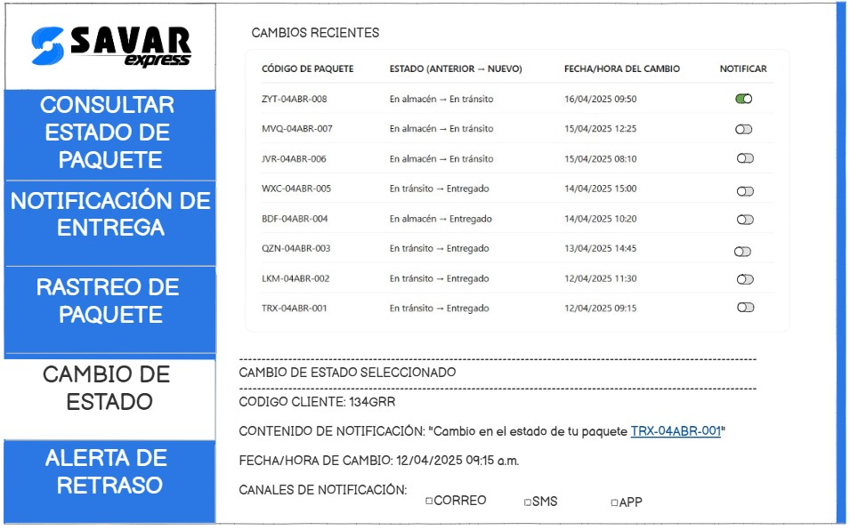
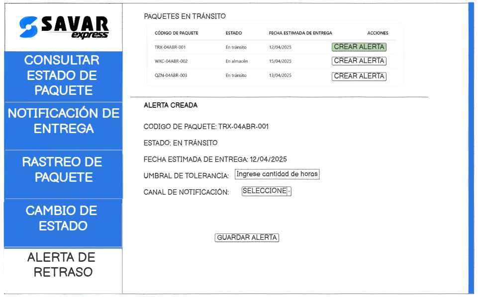

# 3.3. Módulo 3 - Seguimiento del paquete (tracking)

# Por: Baruc Toribio
 

## **Requerimientos funcionales**

## Caso de Uso 1: Consultar estado de paquete

RF-1.1**: El sistema debe ofrecer una opción visible y accesible para "Consultar estado de paquete".

RF-1.2**: El sistema debe mostrar el estado actual del paquete (Ej. En tránsito, En almacén, Entregado, etc.).

RF-1.3**: El sistema debe mostrar la ubicación más reciente registrada del paquete.

RF-1.4**: El sistema debe permitir visualizar el historial de eventos del paquete

| **Campo**            | **Descripción**                                                                 |
|----------------------|---------------------------------------------------------------------------------|
| **Objetivo**         | Permitir al responsable de almacén consultar el estado de un paquete.           |
| **Descripción**      | Proceso para que el responsable consulte el estado y el historial de un paquete mediante su número de seguimiento. |
| **Actor Primario**   | Responsable de almacén                                                           |
| **Actor Secundario** | Sistema de gestión de paquetes                                                   |
| **Precondiciones**   | El paquete debe estar registrado en el sistema.                                 |
| **Flujo de Eventos** | 1. El responsable accede al sistema.  2. Selecciona "Consultar estado de paquete".  3. Ingresa el número de seguimiento del paquete.  4. El sistema muestra el estado y la ubicación del paquete. |
| **Postcondición**    | El sistema muestra el estado actualizado del paquete.                           |

---

### Prototipo

## Caso de Uso 2: Enviar notificación de entrega

RF-2.1**: El sistema debe permitir al responsable de almacén acceder a la lista de paquetes entregados.

RF-2.2**: El sistema debe validar que el paquete seleccionado esté marcado como “entregado” antes de habilitar la opción de notificación.

RF-2.3**: El sistema debe mostrar una opción visible y accesible para "Enviar notificación de entrega".

RF-2.4**: El sistema debe permitir enviar la notificación a través de correo electrónico, SMS u otro canal configurado.

RF-2.5**: El sistema debe registrar la fecha y hora del envío de la notificación.

| **Campo**            | **Descripción**                                                                 |
|----------------------|---------------------------------------------------------------------------------|
| **Objetivo**         | Permitir que el responsable de almacén envíe una notificación al cliente una vez que el paquete ha sido entregado. |
| **Descripción**      | Proceso en el que el responsable de almacén envía una notificación de entrega al cliente. |
| **Actor Primario**   | Responsable de almacén                                                           |
| **Actor Secundario** | Sistema de gestión de paquetes                                                   |
| **Precondiciones**   | El paquete debe estar marcado como entregado en el sistema.                     |
| **Flujo de Eventos** | 1. El responsable accede al sistema.  2. Selecciona el paquete entregado.  3. El sistema muestra la opción para enviar la notificación.  4. El responsable selecciona la opción de enviar notificación. |
| **Excepciones**      | Si el paquete no está marcado como entregado, el sistema muestra un mensaje de error. |
| **Postcondición**    | El cliente recibe la notificación sobre la entrega.                             |

---

### Prototipo

## Caso de Uso 3: Realizar rastreo de paquete

RF-3.1: El sistema debe permitir ingresar un número de paquete y mostrar su trazabilidad.

RF-3.2: El sistema debe validar que el número de paquete exista antes de mostrar información.

RF-3.3: El sistema debe mostrar la ubicación actual del paquete, historial de movimientos, y estado.

RF-3.4: El sistema debe habilitar acciones adicionales como imprimir, actualizar estado o agregar notas.

| **Campo**            | **Descripción**                                                                 |
|----------------------|---------------------------------------------------------------------------------|
| **Objetivo**         | Permitir al personal del área de almacén consultar el estado y recorrido de un paquete. |
| **Descripción**      | Proceso mediante el cual el personal de almacén utiliza el sistema para rastrear un paquete a lo largo de su tránsito. |
| **Actor Primario**   | Personal del área de almacén                                 |
| **Actor Secundario** | Sistema de gestión logística                             |
| **Precondiciones**   | El paquete debe estar registrado en el sistema con un número de guía válido.   |
| **Flujo de Eventos** | 1. El personal de almacén accede al sistema. 2. Selecciona la opción "Rastreo de paquete". 3. Ingresa el número de guía o seguimiento. 4. El sistema muestra el historial de eventos, movimientos y ubicación actual. 5. El personal verifica la información y toma decisiones si es necesario. |
| **Excepciones**      | Si el número de guía no es válido o no se encuentra en el sistema, se muestra un mensaje de error. |
| **Postcondición**    | Se visualiza la trazabilidad del paquete y su estado actualizado.              |

---

### Prototipo

## Caso de Uso 4: Notificar cambio de estado del paquete al cliente

RF-4.1: El sistema debe permitir al responsable de almacén acceder al historial de paquetes con cambios de estado recientes.

RF-4.2: El sistema debe permitir al responsable de almacén seleccionar el cliente al que notificar sobre el cambio de estado.

RF-4.3:El sistema debe generar automáticamente el contenido de la notificación con los datos del paquete, el nuevo estado y la fecha/hora del cambio.

RF-4.4:El sistema debe mostrar una confirmación visual de envío exitoso o un mensaje de error si no se pudo notificar al cliente.

RF-4.5: El sistema debe guardar un registro del cambio de estado y la notificación como parte del historial del paquete.

---

| **Campo**            | **Descripción**                                                                 |
|----------------------|---------------------------------------------------------------------------------|
| **Objetivo**         | Permitir que el responsable de almacén notifique al cliente sobre un cambio en el estado de un paquete. |
| **Descripción**      | Proceso en el cual el responsable notifica al cliente sobre un cambio en el estado de un paquete. |
| **Actor Primario**   | Responsable de almacén                                                           |
| **Actor Secundario** | Sistema de gestión de paquetes, Cliente                                          |
| **Precondiciones**   | El paquete debe estar registrado y debe haber un cambio de estado.              |
| **Flujo de Eventos** | 1. El responsable accede al sistema.   2. Selecciona el paquete cuyo estado ha cambiado.   3. El sistema muestra las opciones para notificar al cliente.   4. El responsable ingresa la información necesaria (si aplica) y envía la notificación al cliente. |
| **Excepciones**      | Si el estado del paquete no ha cambiado, el sistema muestra un mensaje de error. |
| **Postcondición**    | El cliente recibe la notificación del cambio de estado del paquete.             |

---

### Prototipo

## Caso de Uso 5: Crear alerta de retraso de paquete

RF-5.1**: El sistema debe permitir visualizar la lista de paquetes con fecha estimada de entrega registrada.

RF-5.2**: El sistema debe validar que el paquete seleccionado tenga una fecha estimada de entrega antes de permitir configurar la alerta.

RF-5.3**: El sistema debe mostrar una opción clara para “Crear alerta de retraso”.

RF-5.4**: El sistema debe permitir configurar los parámetros de la alerta (Ej. umbral de tolerancia en horas/días, canal de notificación).

RF-5.5**: El sistema debe permitir guardar la configuración de la alerta vinculada al paquete.

RF-5.6**: El sistema debe monitorear automáticamente si se cumple o excede la fecha estimada de entrega sin confirmación de recepción.

RF-5.7**: El sistema debe generar y enviar la alerta configurada al responsable cuando se detecta el retraso.

| **Campo**            | **Descripción**                                                                 |
|----------------------|---------------------------------------------------------------------------------|
| **Objetivo**         | Permitir que el responsable configure una alerta para un paquete que se espera con retraso. |
| **Descripción**      | Proceso mediante el cual el responsable configura una alerta para ser notificado cuando un paquete no llega a la fecha prevista. |
| **Actor Primario**   | Responsable de almacén                                                           |
| **Actor Secundario** | Sistema de gestión de paquetes                                                   |
| **Precondiciones**   | El paquete debe tener una fecha estimada de entrega.                            |
| **Flujo de Eventos** | 1. El responsable accede al sistema.  2. Selecciona el paquete con fecha estimada de entrega.  3. El sistema muestra la opción de "Crear alerta de retraso".  4. El responsable configura la alerta. |
| **Excepciones**      | Si no hay fecha estimada, el sistema muestra un mensaje de error.               |
| **Postcondición**    | El responsable recibe una alerta cuando el paquete no llega a tiempo.          |

---

### Prototipo

