# Módulo de Despacho - Requerimientos Funcionales y Casos de Uso

### PROTOTIPO
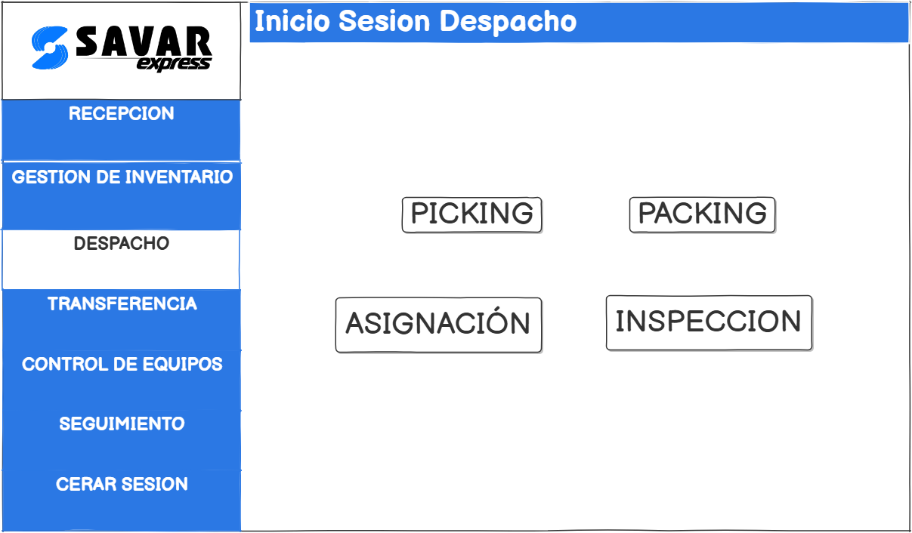

### Requerimientos Caso de Uso 1: Generar y gestionar lista de picking
- RF1.1: Generar lista de picking basada en pedidos pendientes.
- RF1.2: Consultar ubicaciones de productos.
- RF1.3: Asignar responsable de picking.
- RF1.4: Actualizar estado de lista en tiempo real.
- RF1.5: Permitir reimpresión o modificación de listas.

### Caso de Uso 1: 
| Campo | Descripción |
|:------|:------------|
| **Objetivo** | Crear y administrar listas de picking a partir de pedidos confirmados. |
| **Descripción** | El sistema organiza automáticamente las listas de picking basadas en pedidos pendientes, permitiendo la asignación y edición de dichas listas. |
| **Actor Primario** | Responsable de almacén. |
| **Actor Secundario** | Sistema de gestión de pedidos e inventario. |
| **Precondiciones** | Pedido debe estar confirmado y productos disponibles en inventario. |
| **Flujo de Eventos** | 1. Accede al sistema. 2. Selecciona "Generar lista de picking". 3. Elige pedido. 4. Genera lista. 5. Asigna responsable. 6. Guarda y valida la lista. |
| **Postcondición** | Lista de picking generada y lista para ejecución. |

### PROTOTIPO
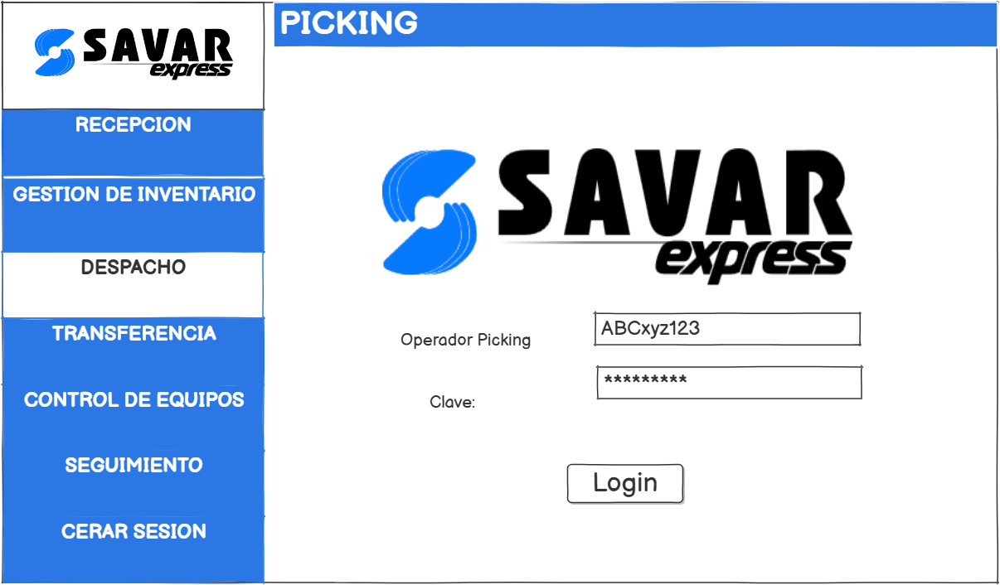

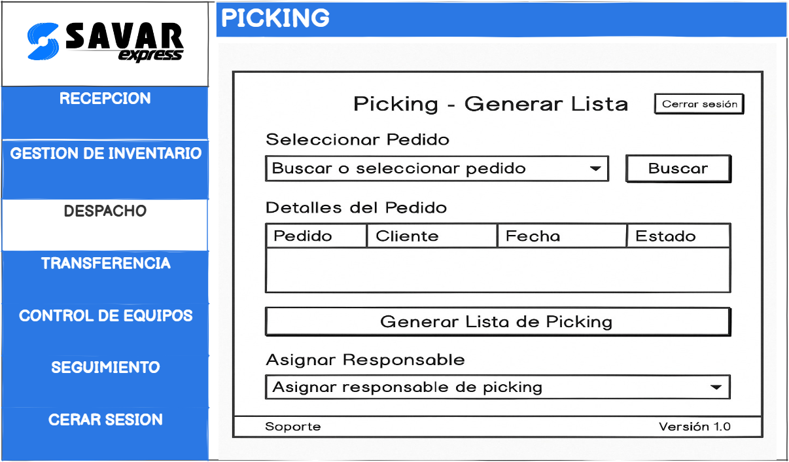

### Requerimiento Caso de Uso 2: Ejecución y verificación del picking
- RF2.1: Permitir escaneo de códigos para validar recolección.
- RF2.2: Alertar errores de cantidad o ubicación.
- RF2.3: Registrar hora de inicio y fin de picking.
- RF2.4: Generar reporte de inconsistencias.
- RF2.5: Actualizar inventario tras validación.

### Caso de Uso 2:
| Campo | Descripción |
|:------|:------------|
| **Objetivo** | Realizar la recolección de productos y verificar correspondencia con el pedido. |
| **Descripción** | Los operadores recolectan productos siguiendo la lista y escanean los productos para verificación. |
| **Actor Primario** | Operario de picking. |
| **Actor Secundario** | Sistema de control de inventario. |
| **Precondiciones** | Lista de picking generada y validada. |
| **Flujo de Eventos** | 1. Accede a la lista. 2. Recolecta productos. 3. Escanea productos. 4. Valida productos. 5. Reporta diferencias. 6. Finaliza picking. |
| **Postcondición** | Productos recolectados correctamente o errores reportados. |

### PROTOTIPO
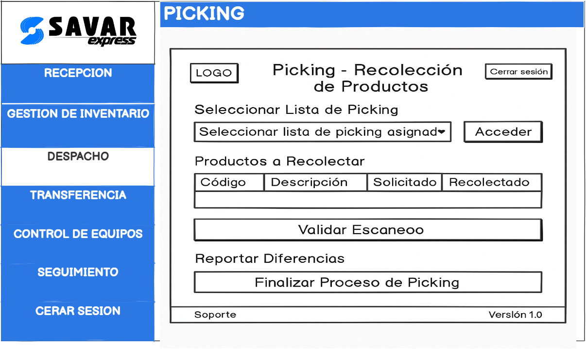

### Requerimiento Caso de Uso 3: Preparación y ejecución del packing
- RF3.1: Generar etiquetas de envío.
- RF3.2: Sugerir tipo de embalaje adecuado.
- RF3.3: Registrar peso y volumen de paquetes.
- RF3.4: Capturar fotos de empaques.
- RF3.5: Asociar paquetes a pedido.

### Caso de Uso 3:
| Campo | Descripción |
|:------|:------------|
| **Objetivo** | Empacar productos recolectados de manera segura para despacho. |
| **Descripción** | Los productos son embalados siguiendo criterios de tipo y destino. |
| **Actor Primario** | Operario de packing. |
| **Actor Secundario** | Sistema de etiquetado y control de paquetes. |
| **Precondiciones** | Productos correctamente recolectados y verificados. |
| **Flujo de Eventos** | 1. Accede al sistema. 2. Selecciona pedido. 3. Embala productos. 4. Etiqueta. 5. Registra peso y volumen. |
| **Postcondición** | Productos embalados y listos para asignar transporte. |

### PROTOTIPO

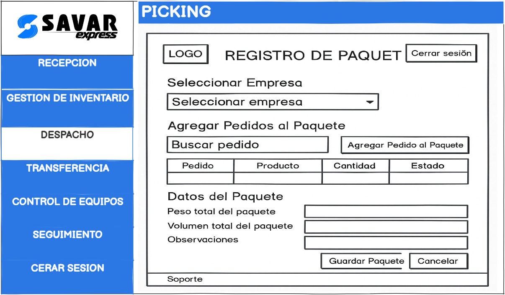

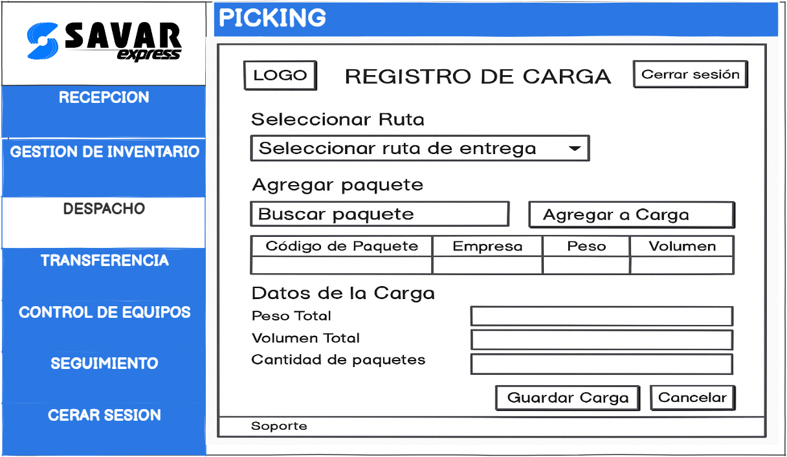

### Requerimiento Caso de Uso 4: Asignación de transporte y conductor
- RF4.1: Mostrar vehículos y conductores disponibles.
- RF4.2: Sugerir transporte óptimo según carga y destino.
- RF4.3: Validar licencia y habilitación del conductor.
- RF4.4: Registrar transporte y conductor asignados.

### Caso de Uso 4:
| Campo | Descripción |
|:------|:------------|
| **Objetivo** | Asignar transporte y conductor apropiados. |
| **Descripción** | Se selecciona el transporte según carga y destino. |
| **Actor Primario** | Coordinador de transporte. |
| **Actor Secundario** | Sistema de gestión de flota. |
| **Precondiciones** | Paquetes listos para despacho. |
| **Flujo de Eventos** | 1. Accede al sistema. 2. Selecciona "Asignar transporte". 3. Visualiza vehículos. 4. Asigna transporte. 5. Confirma asignación. |
| **Postcondición** | Transporte asignado al pedido. |

### PROTOTIPO
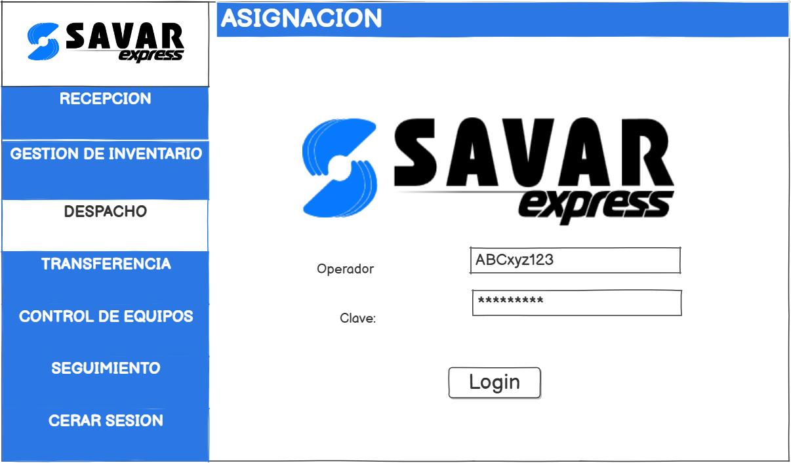

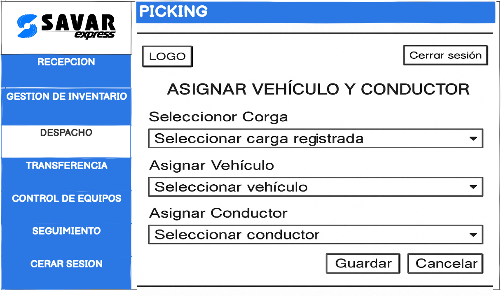

### Requerimiento Caso de Uso 5: Verificación de transporte y conductor
- RF5.1: Checklist de inspección vehicular.
- RF5.2: Validar documentación del conductor.
- RF5.3: Impedir asignación si hay incumplimientos.
- RF5.4: Generar acta digital de inspección.

### Caso de Uso 5:
| Campo | Descripción |
|:------|:------------|
| **Objetivo** | Verificar que el transporte y conductor cumplen requisitos. |
| **Descripción** | Inspección previa al despacho. |
| **Actor Primario** | Inspector de despacho. |
| **Actor Secundario** | Sistema de verificación vehicular. |
| **Precondiciones** | Transporte y conductor asignados. |
| **Flujo de Eventos** | 1. Realiza checklist. 2. Verifica documentos. 3. Registra inspección. 4. Autoriza o rechaza. |
| **Postcondición** | Transporte autorizado o rechazado. |

### PROTOTIPO
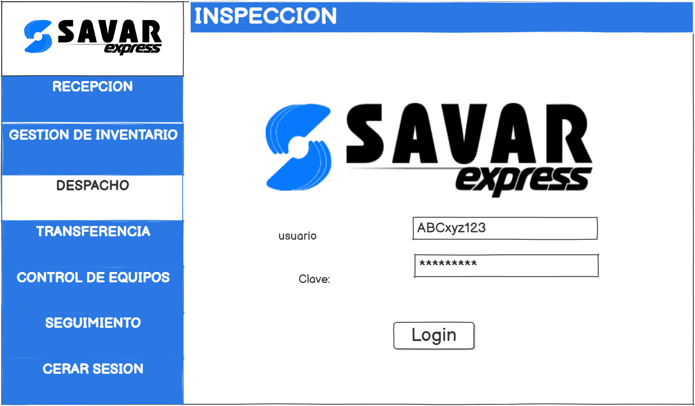

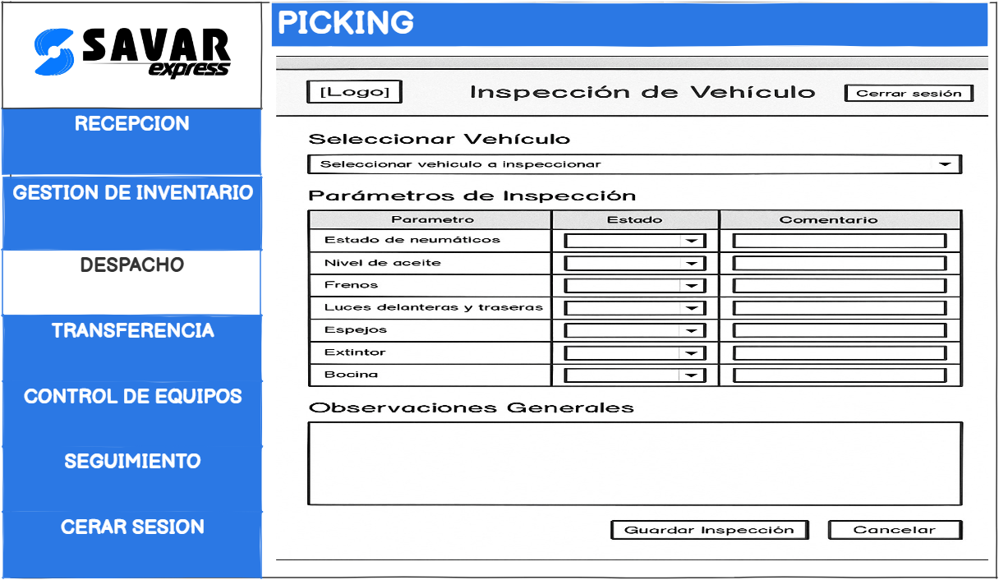

### Requerimiento Caso de Uso 6: Carga de productos al transporte
- RF6.1: Registrar carga de paquetes mediante escaneo.
- RF6.2: Validar carga completa antes de salida.
- RF6.3: Generar manifiesto de carga.
- RF6.4: Registrar responsable y hora de carga.

### Caso de Uso 6:
| Campo | Descripción |
|:------|:------------|
| **Objetivo** | Realizar la carga de productos al transporte asignado. |
| **Descripción** | Escanear y cargar paquetes en el transporte. |
| **Actor Primario** | Responsable de carga. |
| **Actor Secundario** | Sistema de control de carga. |
| **Precondiciones** | Transporte autorizado y paquetes listos. |
| **Flujo de Eventos** | 1. Escanea paquetes. 2. Carga productos. 3. Verifica carga. 4. Registra carga. 5. Genera manifiesto. |
| **Postcondición** | Productos cargados correctamente. |

### PROTOTIPO

### Requerimiento Caso de Uso 7: Confirmación y salida de despacho
- RF7.1: Registrar hora exacta de salida.
- RF7.2: Actualizar estado a "Despachado".
- RF7.3: Integrar con módulo de tracking.
- RF7.4: Generar comprobante de salida.
- RF7.5: Alertar falta de verificaciones previas.

### Caso de Uso 7:
| Campo | Descripción |
|:------|:------------|
| **Objetivo** | Autorizar oficialmente la salida del despacho. |
| **Descripción** | Validar carga y registrar salida para iniciar entrega. |
| **Actor Primario** | Supervisor de despacho. |
| **Actor Secundario** | Sistema de tracking y facturación. |
| **Precondiciones** | Carga completada y manifiesto generado. |
| **Flujo de Eventos** | 1. Revisa carga. 2. Autoriza salida. 3. Registra hora. 4. Actualiza tracking. 5. Genera comprobante. |
| **Postcondición** | Pedido despachado correctamente. |

### PROTOTIPO
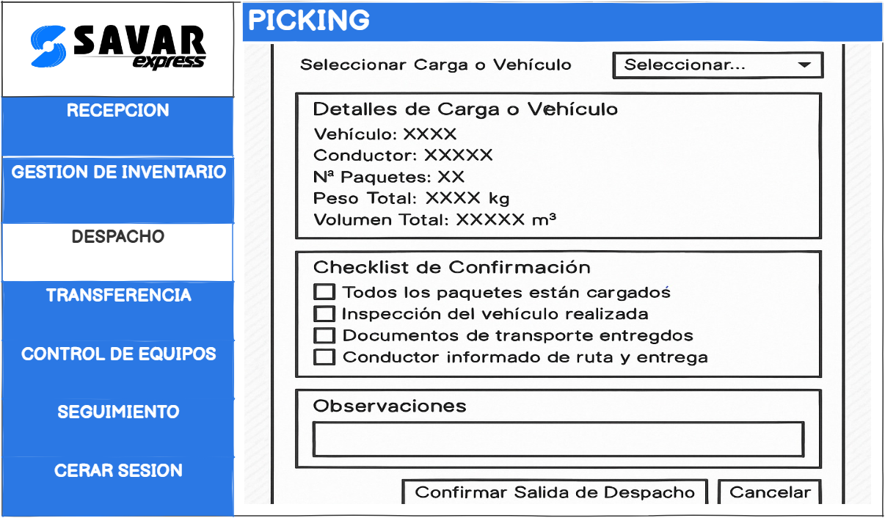