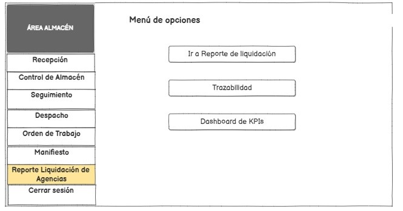
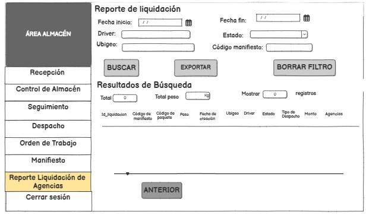
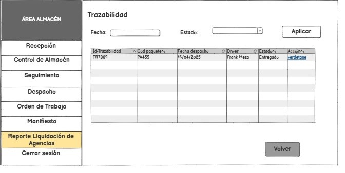
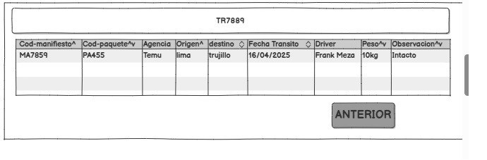
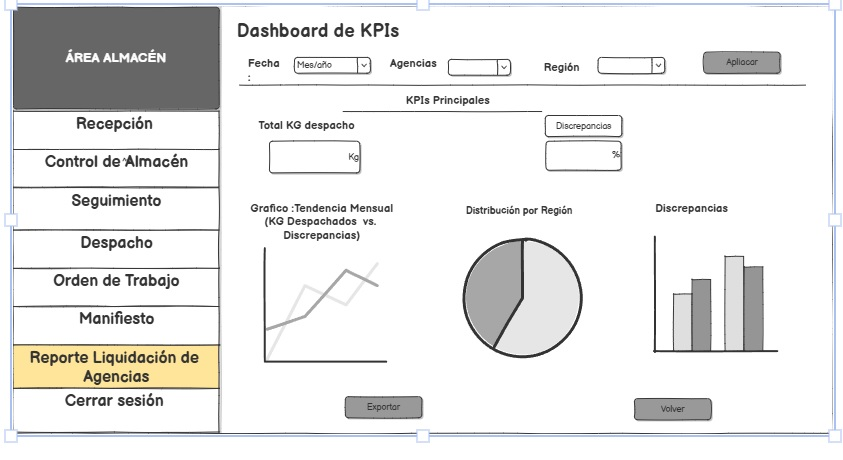

# 3.5. Módulo 5
# Módulo de Reporte Liquidación de Agencias  

## Requerimientos Funcionales  

| Número | Requerimiento                | Descripción                                                                 |
|--------|-----------------------------|-----------------------------------------------------------------------------|
| 1      | **Reporte liquidación**     | Permitir búsquedas dinámicas por: - Fecha/hora (rangos personalizados) - Conductor - Región (Ubigeo origen/destino) - Estado (validado/pendiente/discrepante) |  
| 2      | **Consolidar datos**        | Unir automáticamente información de: - Módulo de Manifiestos (guías, conductores, rutas) - Órdenes de Trabajo (peso, cliente, fecha) **Salida**: Reporte consolidado para validación. |  
| 3      | **Cálculo de totales**      | Sumatorias automáticas de: - Peso total (KG) por agencia/ruta - Montos (según tarifas negociadas por KG/servicio). |  
| 4      | **Dashboard KPIs**          | Visualizar en tiempo real: - Despachos - Discrepancias **Objetivo**: Toma de decisiones estratégicas. |  
| 5      | **Exportación a formatos**  | Generar: - Excel (datos crudos, filtrables para análisis financiero). |  
| 6      | **Trazabilidad**           | Mostrar historial completo por paquete: - Fechas despacho/recepción - Agencias/conductores - Estados (tránsito, entregado). |  
| 7      | **Histórico de liquidación**| Consultar reportes anteriores con filtros: - Período (semana/mes/año) - Agencia - Estado (cerrado/pendiente). |  

# Casos de uso

**CU1:**

| **1. Caso de Uso del Sistema** | Generar Reporte de Liquidación |
|-------------------------------|-------------------------------|
| **2. Descripción** | Permitir búsquedas dinámicas en los reportes de liquidación por: |
| | - Fecha inicio y fin (rangos personalizados) |
| | - Conductor/vehículo |
| | - Ubigeo (origen/destino) |
| | - Estado (validado, pendiente) |
| **3. Actor(es)** | Coordinador de Almacén |
| **4. Precondiciones** | 1. El usuario debe estar autenticado |
| | 2. Los módulos de Manifiesto y Órdenes de Trabajo deben tener datos registrados |
| **5. Postcondiciones** | 1. Se genera un reporte filtrado en Excel/PDF |
| | 2. Los datos quedan registrados para historial |
| **6. Pasos (Flujo Principal)** | |
| 1. El coordinador selecciona "Reporte liquidación de agencias" | El sistema muestra el menú de opciones (P1) |
| 2. El coordinador da clic en "Reporte liquidación" | El sistema le muestra campos vacíos (fecha inicio, fecha fin, ubigeo, driver, manifiesto, estado, etc) |
| 3. Aplica los filtros y hace clic en "Buscar" | El sistema consolida datos de Manifiesto y Órdenes de Trabajo |
| 4. Selecciona "Exportar" (Excel) | El sistema genera el archivo con los datos filtrados |
| **7. Flujo Alternativo** | El coordinador da clic en "volver" | El sistema le dirige al menú de opciones |
| **8. Requerimientos Asociados** | RF1, RF2, RF3, RF5, RF7 |
| **9. Prototipo de Interfaz de Usuario** | P1, P1.1 |

**menú de opciones(P1)**

**Reporte liquidacion(P2)**

**CU 2:**

| **1. Caso de Uso del Sistema**   | Consultar Trazabilidad                                                                              |
| **2. Descripción**              | Permite al Coordinador de Almacén rastrear el historial completo de un paquete o manifiesto, desde su recepción hasta su entrega final, mostrando fechas, ubicaciones, conductores y estados intermedios. |
| **3. Actor(es)**                | Coordinador de Almacén                                                                              |
| **4. Precondiciones**           | - El usuario debe estar autenticado.                                                                |
|                                 | - El paquete/manifiesto debe estar registrado en el sistema.                                        |
| **5. Postcondiciones**          | - Se visualiza el historial completo del paquete.                                                   |
| **6. Pasos (Flujo Principal)**  |                                                                                                     |
| 1. Ingresa al módulo "Reporte de Liquidación" y selecciona "Trazabilidad". | El sistema muestra campo de búsqueda por fecha y estado (P3).             |
| 2. Aplica los filtros y hace clic en "Buscar".               | El sistema consolida datos de Manifiesto y Órdenes de Trabajo.            |
| 3. El coordinador da clic en “volver”.                      | El sistema le dirige al menú de opciones (P1).                           |
| **7. Flujo Alternativo 3.1**    | El coordinador da clic en "ver detalles" | El sistema muestra un modal (P3.1) con los detalles de la trazabilidad. |
| **8. Requerimientos Asociados** | RF6                                                                                                 |
| **9. Prototipo de Interfaz**    | P3, P3.1                                                                                         |

# Trazabilidad(P3)

**modal ver detalle(P3.1)**

**CU 3**

| **1. Caso de Uso del Sistema**   | Dashboard KPIs                                                                                     |
| **2. Descripción**               | Este caso de uso permite al Coordinador de Almacén visualizar indicadores clave de desempeño (KPIs) en tiempo real, relacionados con despachos y discrepancias, facilitando la toma de decisiones estratégicas y la identificación de problemas operativos. |
| **3. Actor(es)**                 | Coordinador de Almacén                                                                             |
| **4. Precondiciones**            | - Los módulos de Manifiesto y Órdenes de Trabajo deben tener datos registrados en el período seleccionado.   - El dashboard debe estar configurado para mostrar los KPIs relevantes. |
| **5. Postcondiciones**           | - Los datos mostrados se pueden exportar para análisis posterior.                                   |
| **6. Pasos (Flujo Principal)**   |                                                                                                     |
| 1. El coordinador presiona "Dashboard KPIs".                  | El sistema muestra pantalla (P4) con campos vacíos (fecha mes/año, agencia, región).              |
| 2. El coordinador da clic en "Aplicar".                        | El sistema muestra KPIs como:   - Total en kg de despachos.  - Discrepancias (%)   Además, se muestran gráficos de tendencias, pastel y barras. |
| 3. El coordinador presiona "Exportar".                        | El sistema exporta el dashboard en formato Excel.                                                  |
| 4. El coordinador presiona "Volver".                          | El sistema lo redirige al menú de opciones.                                                       |
| **7. Flujo Alternativo 3.1**     | El coordinador presiona el KPI “Discrepancias” → El sistema muestra un modal (P4.1) con una tabla detallada de las discrepancias.   Luego da clic en “Exportar” y el sistema genera el Excel correspondiente. |
| **8. Requerimientos Asociados** | RF4                                                                                                 |
| **9. Prototipo de Interfaz**    | P4, P4.1                                                                                            |

**Dashboard KPIs(P4)**
