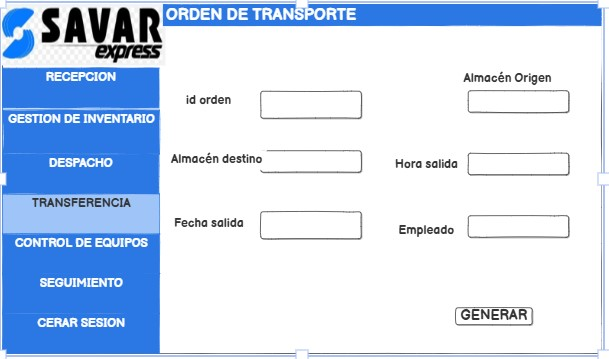
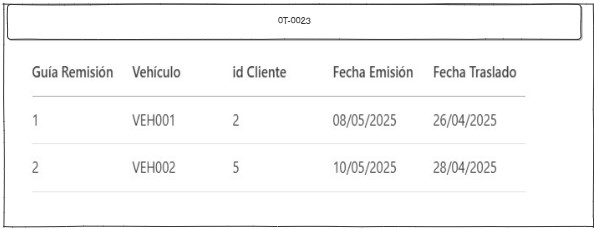
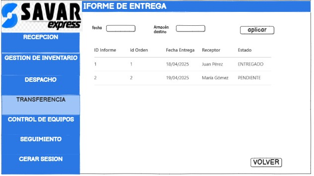

# ✅ Requerimientos Funcionales – Módulo de Transferencia

| Nº  | Requerimiento                         | Descripción                                                                 |
|-----|---------------------------------------|-----------------------------------------------------------------------------|
| RF1 | Registro de salida de paquetes        | El sistema debe permitir registrar la salida de paquetes desde el almacén origen, incluyendo fecha, hora y destino. |
| RF2 | Informe de entrega                    | El sistema debe permitir confirmar la entrega del pedido mediante un formulario. El sistema debe permitir visualizar las entregas ya completadas. Paquete al almacén destino y marcarlo como recibido. |
| RF3 | Registro de incidencias en tránsito   | El sistema debe permitir registrar incidencias como demoras, pérdidas, daños o desvíos durante el traslado. |

---

## 1. Caso de Uso del Sistema: Registrar salida de paquete del almacén origen

### 2. Descripción del caso de uso  
Este caso de uso describe cómo se registra la salida de un paquete desde el almacén origen, iniciando el proceso de transferencia al almacén destino.  

### 3. Actor(es)  
- supervisor de transferencia 

### 4. Precondiciones  
1. El almacenero debe estar logueado en el sistema.  
2. El paquete debe estar en el inventario del almacén origen.  

### 5. Postcondiciones  
1. El paquete se registra como en tránsito y se actualiza el estado en el sistema.  

### 6. Pasos (Flujo de Eventos)  

| Nro. | Acción del Actor                                  | Respuesta del Sistema                                                                 |
|------|--------------------------------------------------|---------------------------------------------------------------------------------------|
| 1    | El supervisor de transferencia selecciona el paquete a transferir en el sistema | El sistema muestra la información detallada del paquete.                              |
| 2    | El supervisor de transferencia confirma los detalles del paquete y selecciona "Registrar salida" | El sistema genera una guía de transporte y marca el paquete como en tránsito.         |
| 3    | El supervisor de transferencia selecciona el almacén destino y el vehículo asignado para la transferencia | El sistema asigna el vehículo y muestra la información del transporte.               |
| 4    | El supervisor de transferencia  confirma la salida del paquete      | El sistema actualiza el inventario del almacén origen y genera un reporte de salida. |

---

ver detalles:

## 2. Caso de Uso del Sistema: Informe entrega almacén destino

### 2. Descripción del caso de uso  
Este caso de uso describe cómo se registra la llegada de un paquete al almacén destino, cerrando el proceso de transferencia.  

### 3. Actor(es)  
- transportista

### 4. Precondiciones  
1. El paquete debe estar en tránsito y asignado a un vehículo.  
2. El almacén destino debe estar registrado en el sistema.  

### 5. Postcondiciones  
1. El paquete se registra como recibido y se actualiza el inventario del almacén destino.  

### 6. Pasos (Flujo de Eventos)  

| Nro. | Acción del Actor                                  | Respuesta del Sistema                                                                 |
|------|--------------------------------------------------|---------------------------------------------------------------------------------------|
| 1    | El transportista del almacén destino ingresa al sistema y selecciona la opción "Registrar llegada de paquete" | El sistema muestra la lista de paquetes en tránsito.                                 |
| 2    | El transportista selecciona el paquete que acaba de llegar | El sistema muestra la información del paquete y su estado.                           |
| 3    | El transportisa confirma la llegada del paquete    | El sistema actualiza el inventario del almacén destino y marca el paquete como recibido. |
| 4    | El transportista imprime o envía el reporte de llegada | El sistema genera un reporte de llegada y cierra la transferencia.                   |

---

## 3. Caso de Uso del Sistema: Gestionar incidencias durante la transferencia

### 2. Descripción del caso de uso  
Este caso de uso describe cómo el sistema permite registrar y gestionar incidencias (daños, pérdidas, retrasos) durante la transferencia entre almacenes.  

### 3. Actor(es)  
transportista

### 4. Precondiciones  
1. El paquete debe estar en tránsito.  
2. El actor debe tener permisos para registrar incidencias.  

### 5. Postcondiciones  
1. La incidencia es registrada en el sistema y notificada al encargado para su resolución.  

### 6. Pasos (Flujo de Eventos)  

| Nro. | Acción del Actor                                  | Respuesta del Sistema                                                                 |
|------|--------------------------------------------------|---------------------------------------------------------------------------------------|
| 1    | El  transportista selecciona el paquete afectado y marca "Registrar incidencia" | El sistema muestra una ventana para registrar los detalles de la incidencia.          |
| 2    | El actor ingresa los detalles de la incidencia (tipo, descripción) | El sistema guarda la incidencia y notifica al responsable de la gestión.             |
| 3    | El sistema actualiza el estado del paquete como "En espera de resolución" | El sistema envía una notificación al encargado del almacén para que gestione la incidencia. |
| 4    | El encargado resuelve la incidencia              | El sistema cierra la incidencia y actualiza el estado del paquete.                    |

 

**tabla**

